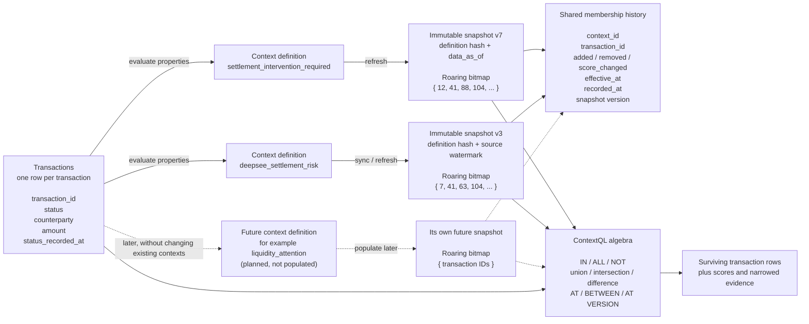

# Post-trade context bitmap model

Each context has a stable `context_id` and owns versioned immutable membership
snapshots. A snapshot is the Roaring bitmap; timestamps, definition hash,
watermark, and version are snapshot metadata. The shared history records when
individual transaction memberships or scores changed.

Adding another context later creates a new definition and its own snapshots.
It does not require altering the transaction table or rewriting existing
context bitmaps.
